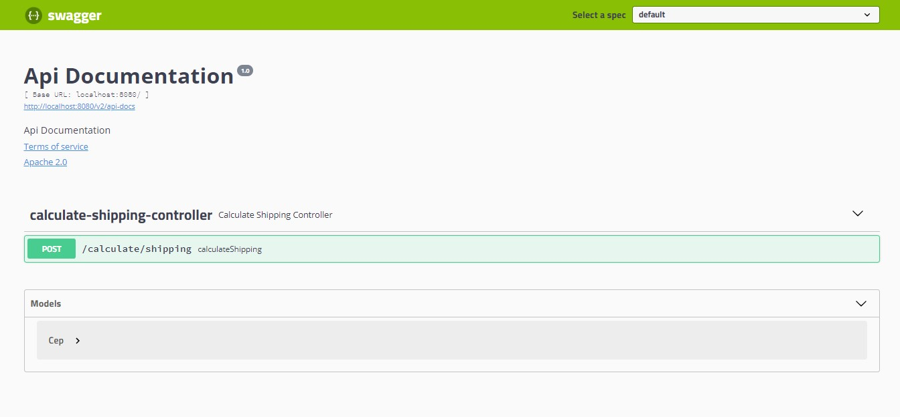
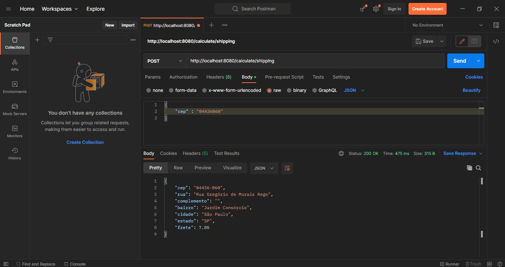

# Consulta Endereço via CEP
#### Para a busca do endereço do CEP, foi consumida a API VIA CEP, https://viacep.com.br/

###### API REST de consulta de endereço e cálculo de frete para um determinado CEP. 
###### O valor do frete é fixo (valores fictícios) de acordo com as regiões do Brasil: 
###### Sudeste (R$ 7,85), Centro-Oeste (R$ 12,50), Nordeste (R$ 15,98), Sul (R$ 17,30) e Norte (R$ 20,83). 
###### O CEP é obrigatório e pode ser passado com ou sem máscara ex:(xxxxx-xxx ou xxxxxxxx), caso o CEP não for encontrado uma mensagem é retornada para o cliente.

#### Stack utilizada no desenvolvimento desta API.
###### Java 11
###### Spring boot
###### API REST Template
###### Documentação Swagger
###### Testes unitários JUnit5

##### Documentação Swagger rodando o projeto localhost, http://localhost:8080/swagger-ui.html

  

##### Teste realizado via Postman.

  

